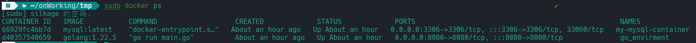
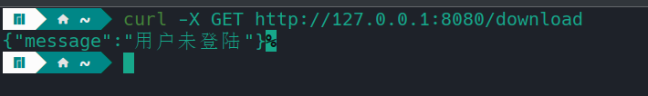
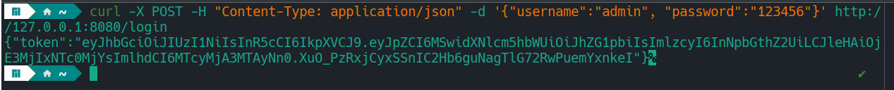
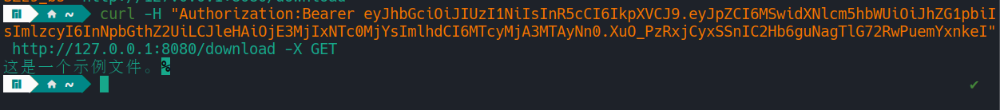

# api
> 笔试代码

## 介绍
- 使用viper读取配置文件
- 实现了后端的登录接口，用jwt实现健全
- 实现后端下载文件的接口
- 使用docker-compose打包
- 使用gorm操作数据库

## 目录结构
```shell
│  config.yml                # 全局配置
│  go.mod
│  go.sum
│  main.go                   # 入口程序
│  README.md
├─deploy                    
│      docker-compose.yml    # docker-compose部署文件
│      init.sql              # 数据库初始化脚本
│      test.txt              # 用来测试下载的文件
├─global
│      config.go            
│      keys.go
├─handle                     # 后端的接口 
│      handle_file.go
│      handle_user.go
├─middleware                
│      auth.go               # 鉴权中间件
│      base.go               # 基础中间件
├─model                     
│      base.go
│      user.go
├─routes                  
│      route.go              # 注册路由
└─utils
        encrypt.go           
        encrypt_test.go
        jwt.go
        jwt_test.go
```
## 用法
```shell
# 部署
cd deploy
docker-compose up -d
```
部署完成后使用`docker ps`查看


在没有登录的情况下访问下载接口，会返回没有登录的提示信息，拒绝下载


通过登录接口登录一下


带上token作为请求头，再访问一遍登录接口，就能够访问到文件内容
> 因为使用的是curl工具测试的，所以会打印文件内容不会下载文件，如果在浏览器访问就会下载文件。笔记本配环境不方便，所以没弄。

